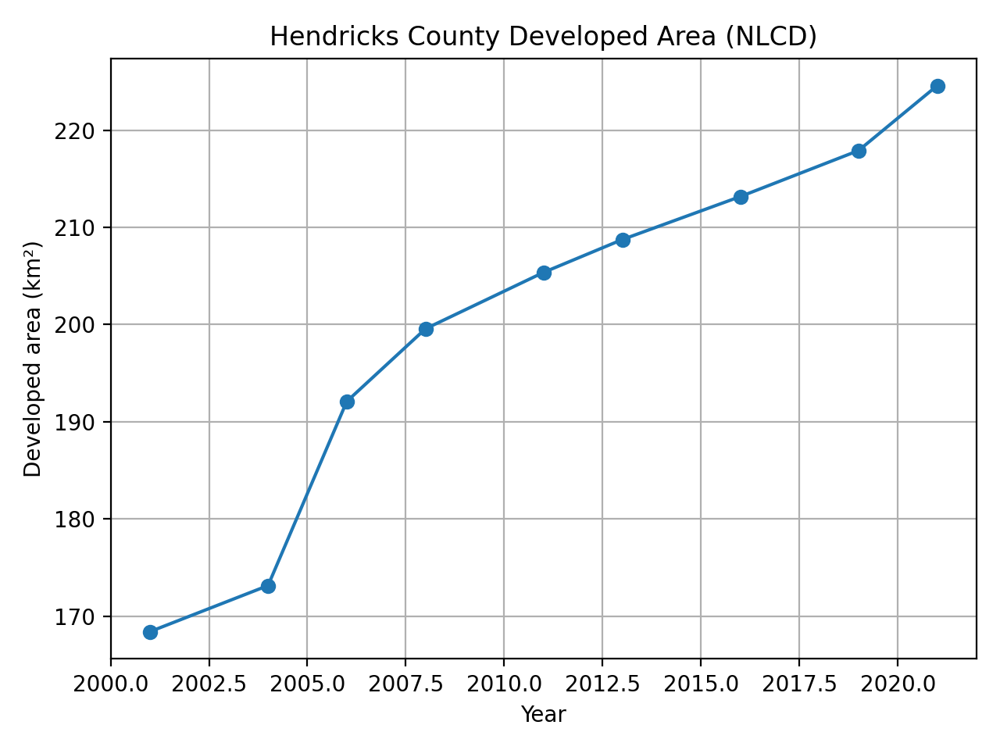
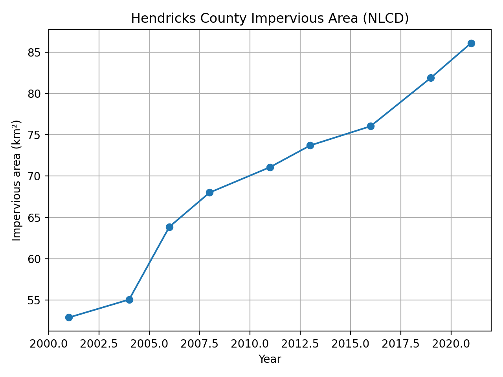
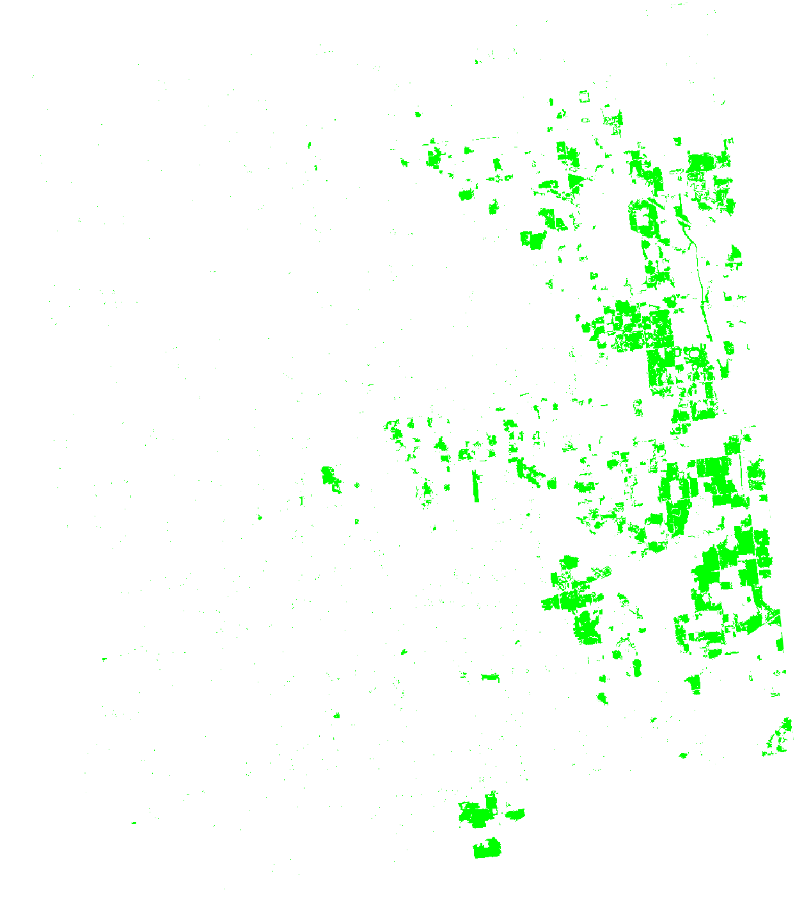
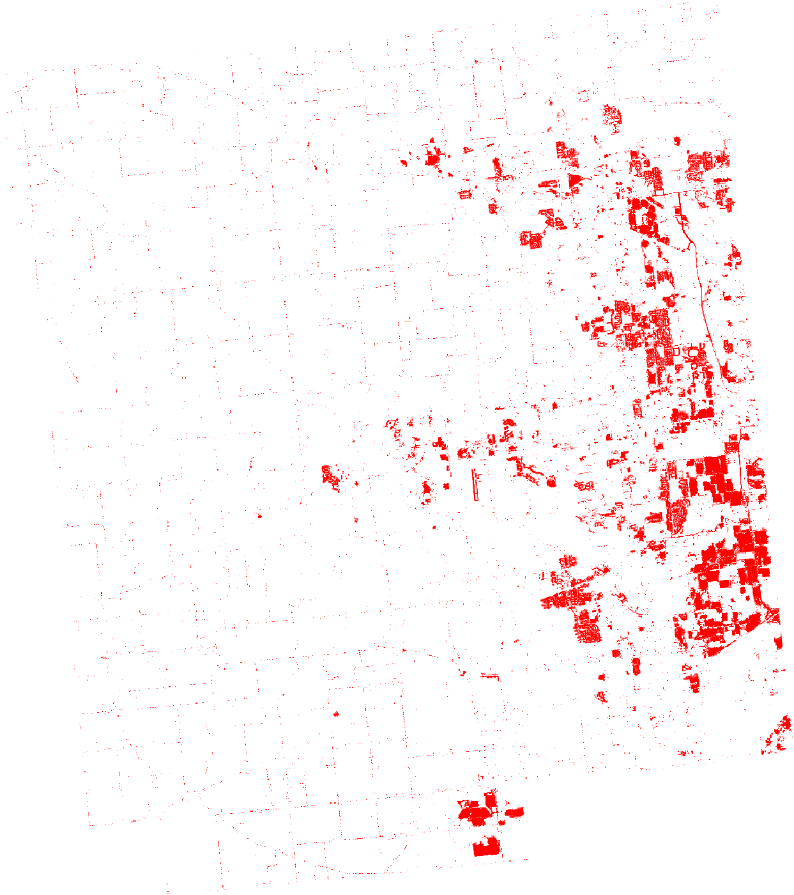

# Hendricks County, IN Urban Growth (2001–2021) — NLCD + Earth Engine

## Goal
Quantify and visualize urban development in Hendricks County, Indiana from 2001 to 2021 using the National Land Cover Database (NLCD) in Google Earth Engine.

## Key results (2001 → 2021)
- **Developed land** increased from **168.43 km²** to **224.57 km²** (**+56.14 km²**, **+33.33%**).
- **Impervious surface area** increased from **52.88 km²** to **86.11 km²** (**+33.22 km²**, **+62.82%**).

(Values computed from NLCD 30m land cover + impervious layers.)

## Visuals
### Developed area over time

### Impervious area over time

### New development hotspots (2001–2021)

### Impervious change (2021–2001)

## Outputs
- `outputs/hendricks_urban_metrics_2001_2021.csv` — developed + impervious area by NLCD epoch
- `outputs/hendricks_nlcd_2001_2021.html` — interactive map (layer toggle)

## Methods (high level)
1. Fetch Hendricks County boundary from US Census TIGER/Line.
2. Load NLCD landcover + impervious for each epoch (2001…2019 from 2019 release; 2021 from 2021 release).
3. Define **Developed** as NLCD classes **21–24**.
4. Compute:
   - Developed area = sum(pixelArea × developedMask)
   - Impervious area = sum(pixelArea × (impervious%/100))
5. Export summary table and map visualizations.

## How to reproduce
### Prereqs
- Google Earth Engine account + Cloud project enabled

### Run
Open `notebooks/hendricks_urban_growth.ipynb` and run cells top-to-bottom.

## Data sources
- NLCD (USGS/MRLC) landcover + impervious (30m)
- US Census TIGER/Line county boundaries

## Limitations
- NLCD is 30m resolution; small parcel changes may not be captured.
- “Developed” is based on NLCD classification; misclassification is possible at edges.

## Next improvements (optional)
- Add intensity breakdown (21/22/23/24) over time.
- Compare growth near major roads/towns (buffer analysis).
